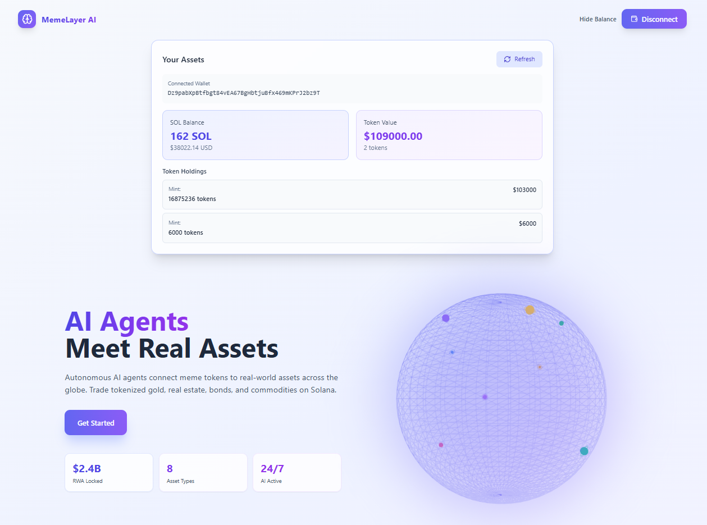

<div align="center">

⚠️ **Currently in Development** • 🚀 **Open for Early Adopters**

# 🧠 MemeLayer

### **The Next-Gen L2 for RWA-Backed Memes on Solana**

*After Hyperliquid revolutionized perps and Astar bridged ecosystems, MemeLayer brings institutional RWA to meme culture*

[](https://solana.com)
[](LICENSE)
[]()

[🚀 Launch App](https://memelayerai.duckdns.org/) • [📖 Docs](https://memelayerai.duckdns.org/) • [💬 Join Early Adopters](https://memelayerai.duckdns.org/)



</div>

---

## 🎯 Early Access Program

We're currently in **active development** and looking for early adopters to help shape the future of RWA-backed memes!

### Be an Early Adopter:
1. **Visit**: [memelayerai.duckdns.org](https://memelayerai.duckdns.org/)
2. **Connect Wallet**: Phantom or Solflare
3. **Explore**: Test the platform and provide feedback
4. **Earn**: Early adopters get exclusive benefits

> 💡 **Note**: Platform is in alpha. Features are being actively developed and may change.

---

## Why MemeLayer?

The meme economy is **$50B+** but has zero real backing. We're changing that.

**MemeLayer** = AI-verified RWA + Meme tokens + Solana speed

```
Traditional Finance → Tokenized Assets → MemeLayer → Memes with Real Value
```

---

## What We're Building

### 🎯 Core Features

- **AI-Verified RWA Pools** - Gold, real estate, bonds backing meme tokens
- **Sub-Second Finality** - Built on Solana for instant trades
- **Institutional Grade** - Audited contracts, compliant framework
- **Global Liquidity** - 8 financial hubs, unified orderbook
- **Autonomous Agents** - AI validates assets 24/7

### 💎 Planned Pools (Coming Soon)

| Token | Backed By | Target TVL | Est. APY |
|-------|-----------|------------|----------|
| 🐸 PEPE Gold | Physical Gold | $100M+ | 8-12% |
| 🐕 DOGE Estate | Real Estate | $80M+ | 10-15% |
| 😺 CAT Bonds | US Treasuries | $60M+ | 5-7% |
| 🦍 APE DeFi | Yield Strategies | $50M+ | 15-20% |

---

## Tech Stack

**Blockchain**: Solana + Anchor  
**AI/ML**: TensorFlow + PyTorch  
**Backend**: TypeScript + Python  
**Frontend**: React + Three.js + Tailwind  
**Infra**: Docker + AWS

---

## Quick Start

### For Users (Early Adopters)
```bash
1. Visit https://memelayerai.duckdns.org
2. Connect Phantom/Solflare wallet
3. Explore the platform (Alpha version)
4. Join our community for updates
```

### For Developers
```bash
# Clone repository
git clone https://github.com/memelayerai/core-app
cd core-app

# Install dependencies
npm install

# Setup environment
cp .env.example .env
# Add your Solana RPC and API keys

# Run development server
npm run dev
```

**SDK (Coming Soon):**
```bash
npm install @memelayerai/sdk
```

**Example Usage:**
```typescript
import { MemeLayer } from '@memelayerai/sdk';

const ml = new MemeLayer({ network: 'devnet' });
await ml.pools.stake('PEPE-GOLD', amount);
```

---

## Architecture

```
User → Frontend (React/Three.js)
         ↓
    API Gateway (Node.js)
         ↓
   ┌─────┴─────┐
   ↓           ↓
AI Agent    Oracle
   ↓           ↓
   └─────┬─────┘
         ↓
  Solana Programs (Rust)
         ↓
   RWA Verification Layer
```

---

## Development Roadmap

**Q1 2026** 🚧 Alpha Launch (Current)
- Landing page & wallet integration
- Core smart contracts
- AI verification engine v1

**Q2 2026** 📋 Beta Release
- First RWA pools live
- Trading interface
- Mobile responsive

**Q3 2026** 🚀 Mainnet Launch
- Full platform release
- Cross-chain bridge
- Mobile apps

**Q4 2026** 🔮 Advanced Features
- DAO governance
- Advanced AI features
- Global expansion

---

## Community & Support

We're **community-driven** and open source!

### Join Us:
- 🌐 **Website**: [memelayerai.duckdns.org](https://memelayerai.duckdns.org)
- 💬 **Discord**: Coming soon
- 🐦 **Twitter**: Coming soon
- 📧 **Email**: hello@memelayer.ai

### Early Adopter Benefits:
- 🎁 Exclusive NFT badges
- 💰 Token airdrops (planned)
- 🗳️ Governance voting rights
- 👥 Direct access to dev team
- 📊 Beta feature access

---

## Contributing

We welcome contributors! This is an open-source project.

### How to Contribute:
1. Fork the repository
2. Create your feature branch (`git checkout -b feature/amazing-feature`)
3. Commit your changes (`git commit -m 'Add some amazing feature'`)
4. Push to the branch (`git push origin feature/amazing-feature`)
5. Open a Pull Request

Read [CONTRIBUTING.md](CONTRIBUTING.md) for detailed guidelines.

### Development Grants (Planned):
- 🔧 Integration: $10K-25K
- 💡 Innovation: $25K-50K
- 🔬 Research: $5K-15K

---

## Security

🔒 **Development Phase**: Smart contracts are being developed and will undergo professional audits before mainnet launch.

### Planned Security Measures:
- ✅ Multi-signature wallets
- ✅ Time-locked upgrades
- ✅ Professional audits (CertiK, Trail of Bits)
- ✅ Bug bounty program
- ✅ Insurance coverage

---

## Project Structure

```
memelayer-platform/
├── frontend/          # React app with Three.js
├── backend/           # Node.js API
├── programs/          # Solana smart contracts
├── ai-agent/          # Python AI service
├── sdk/              # TypeScript SDK
└── docs/             # Documentation
```

---

## License

MIT License - see [LICENSE](LICENSE) file for details.

---

<div align="center">

### 🌟 Star us on GitHub if you believe in RWA-backed memes!

**MemeLayer** - Where memes meet institutional finance

Made with ⚡ on Solana by the community

[Website](https://memelayerai.duckdns.org) • [App](https://memelayerai.duckdns.org) • [Docs](https://memelayerai.duckdns.org)

---

⚠️ **Disclaimer**: This project is in active development. Platform features are experimental. Cryptocurrency investments carry risk. Always DYOR (Do Your Own Research). This is not financial advice.

**Alpha Version** • **Testnet Only** • **Not Audited Yet**

</div>